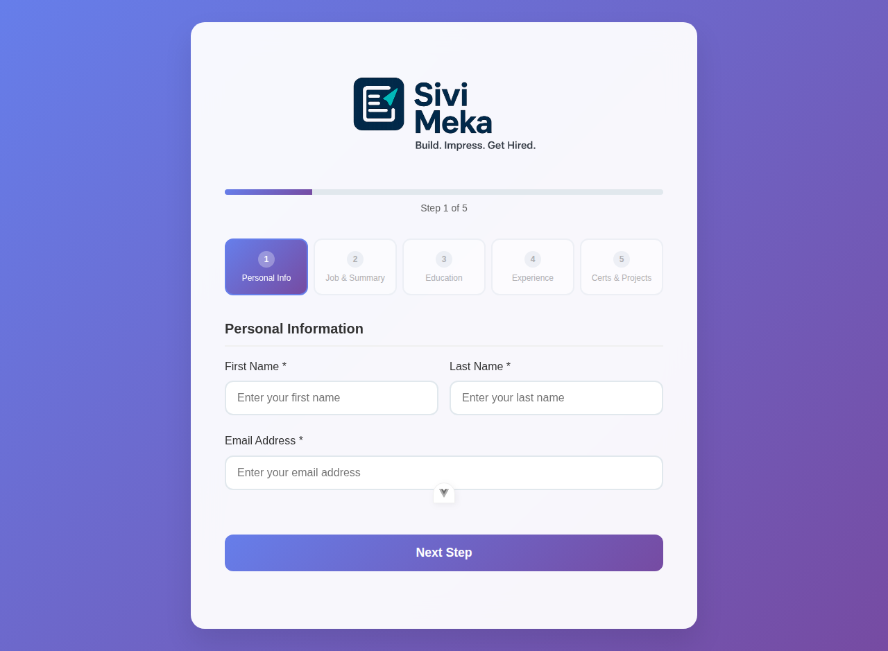
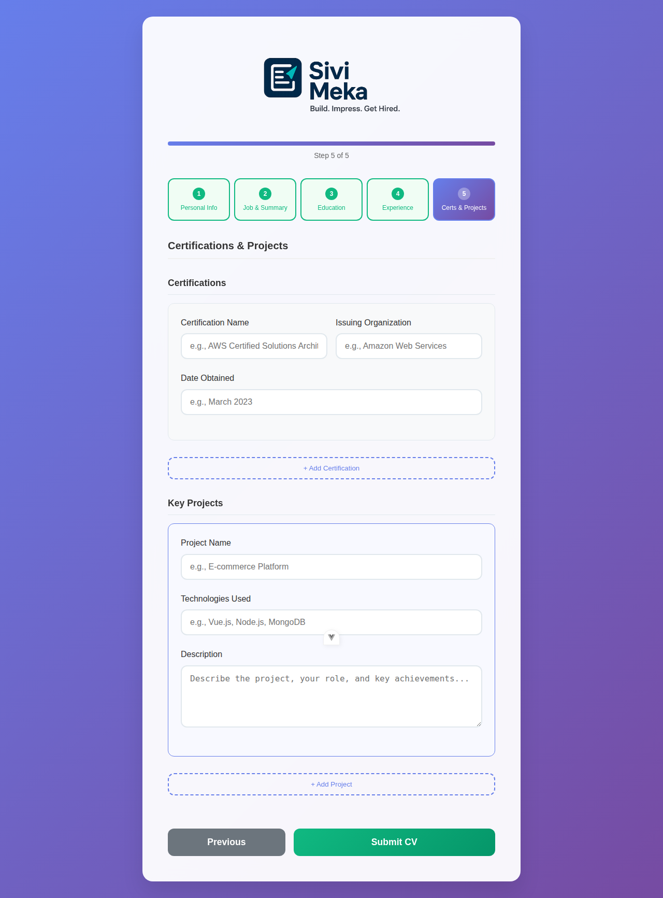
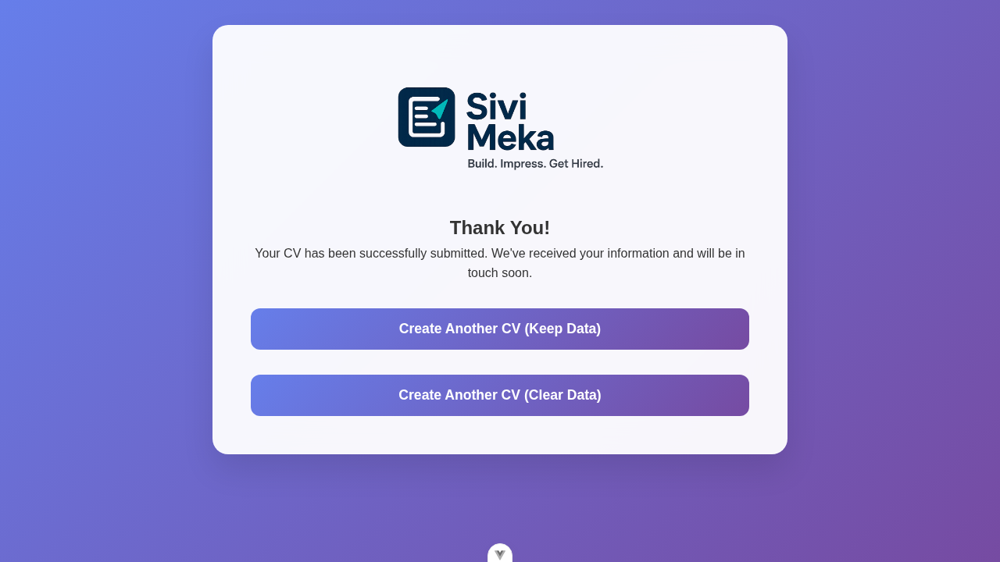
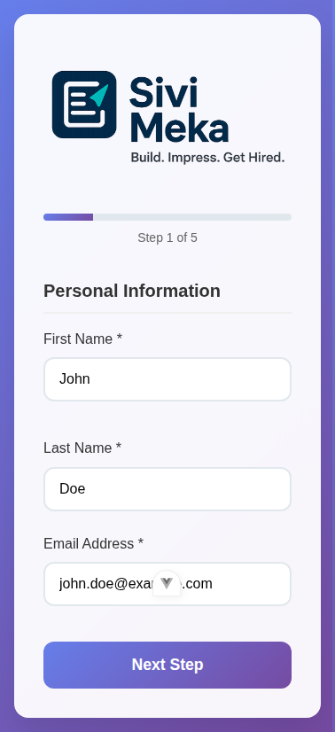
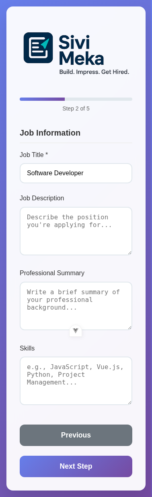
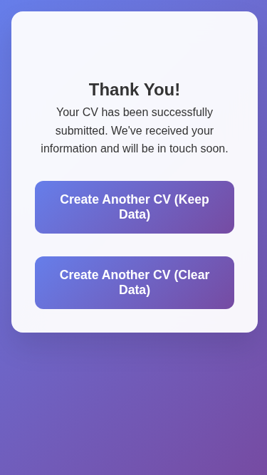

# Sivi Meka - Professional CV Builder

A modern, expressive Vue.js web application for building professional CVs with style.

## Features

- **Modern Multi-Step Design**: Clean 5-step wizard interface with progress tracking
- **Professional UI**: Modern gradient backgrounds, glassmorphism effects, and intuitive navigation
- **Comprehensive Form Sections**:
  - **Step 1**: Personal Information (Name, Email)
  - **Step 2**: Job Information & Professional Summary (Title, Description, Summary, Skills)
  - **Step 3**: Education (Dynamic add/remove multiple degrees)
  - **Step 4**: Work Experience (Dynamic add/remove multiple positions)
  - **Step 5**: Certifications & Key Projects (Dynamic add/remove multiple entries)
- **Step Navigation**: Navigate between form steps with visual progress indicator
- **Dynamic Fields**: Add/remove multiple entries for education, work experience, certifications, and projects
- **Form Validation**: Required field validation with user-friendly error messages
- **Responsive Design**: Fully responsive layout optimized for desktop, tablet, and mobile devices with adaptive navigation and touch-friendly interface
- **Two-Screen Flow**: Clean form submission flow with dedicated thank you page
- **Data Persistence**: Form data is maintained during navigation between steps

## Screenshots

### Desktop Experience

#### CV Form - Personal Information (Step 1)


#### CV Form - Certifications & Projects (Step 5)


#### Thank You Page - Desktop


### Mobile Responsive Design

The application features a fully responsive design optimized for mobile devices with:
- **Adaptive Layout**: Form sections and navigation adapt seamlessly to smaller screens
- **Touch-Friendly Interface**: All buttons and form elements are optimized for touch interaction
- **Optimized Typography**: Text scaling and spacing adjust for mobile readability
- **Preserved Functionality**: All features work seamlessly across devices

#### CV Form - Mobile View (Step 1)


#### CV Form - Mobile View (Step 2)


#### Thank You Page - Mobile


## Technology Stack

- **Vue.js 3**: Modern JavaScript framework
- **Vue Router**: Client-side routing
- **Vite**: Fast build tool and development server
- **Modern CSS**: Custom styling with gradients, backdrop filters, and responsive design

## Development

### Prerequisites

- Node.js (v16 or higher)
- npm

### Installation

```bash
# Clone the repository
git clone https://github.com/EvanieWares/sivimeka.git
cd sivimeka

# Install dependencies
npm install
```

### Development Server

```bash
# Start development server
npm run dev
```

The application will be available at `http://localhost:5173`

### Build for Production

```bash
# Build for production
npm run build
```

### Preview Production Build

```bash
# Preview production build
npm run preview
```

## Usage

1. **Fill the Form**: Complete the CV form with your personal and professional information
2. **Dynamic Sections**: Use the "Add" buttons to include multiple education entries, work experiences, certifications, and projects
3. **Submit**: Click "Submit CV" to complete the process
4. **Confirmation**: View the thank you page with a summary of your submission
5. **Create Another**: Use "Create Another CV" to start fresh

## Project Structure

```
sivimeka/
├── public/                    # Static assets and PWA resources
│   ├── android-chrome-*.png   # PWA icons
│   ├── apple-touch-icon.png   # iOS icon
│   ├── favicon-*.png          # Favicon variants
│   ├── favicon.ico            # Main favicon
│   └── site.webmanifest       # PWA manifest
├── src/
│   ├── components/            # Reusable Vue components
│   │   ├── CertificationsProjectsSection.vue  # Certifications & projects form
│   │   ├── EducationSection.vue               # Education form section
│   │   ├── JobInfoSection.vue                 # Job info form section
│   │   ├── Logo.vue                           # Application logo component
│   │   ├── PersonalInfoSection.vue            # Personal info form section
│   │   └── WorkExperienceSection.vue          # Work experience form section
│   ├── views/                 # Page components
│   │   ├── CVForm.vue         # Main multi-step CV form
│   │   └── ThankYou.vue       # Success/thank you page
│   ├── router/                # Vue Router configuration
│   │   └── index.js           # Route definitions
│   ├── assets/                # CSS and static assets
│   │   ├── SiviMeka.png       # Logo image
│   │   ├── SiviMekaWithPadding.png  # Logo with padding
│   │   └── main.css           # Global styles
│   ├── App.vue                # Root component
│   └── main.js                # Application entry point
├── .vscode/                   # VS Code configuration
├── eslint.config.js           # ESLint configuration
├── index.html                 # HTML entry point
├── jsconfig.json              # JavaScript project configuration
├── package.json               # Dependencies and scripts
├── vite.config.js             # Vite build configuration
└── README.md                  # Project documentation
```

## License

This project is licensed under the MIT License - see the [LICENSE](LICENSE) file for details.
